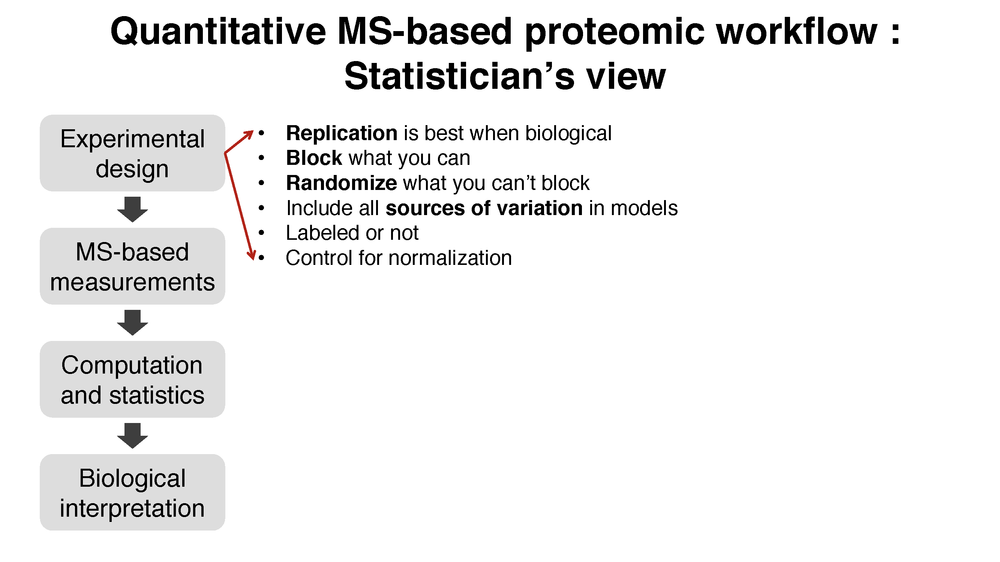
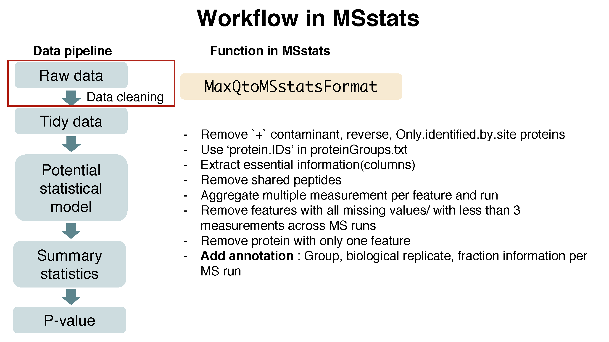
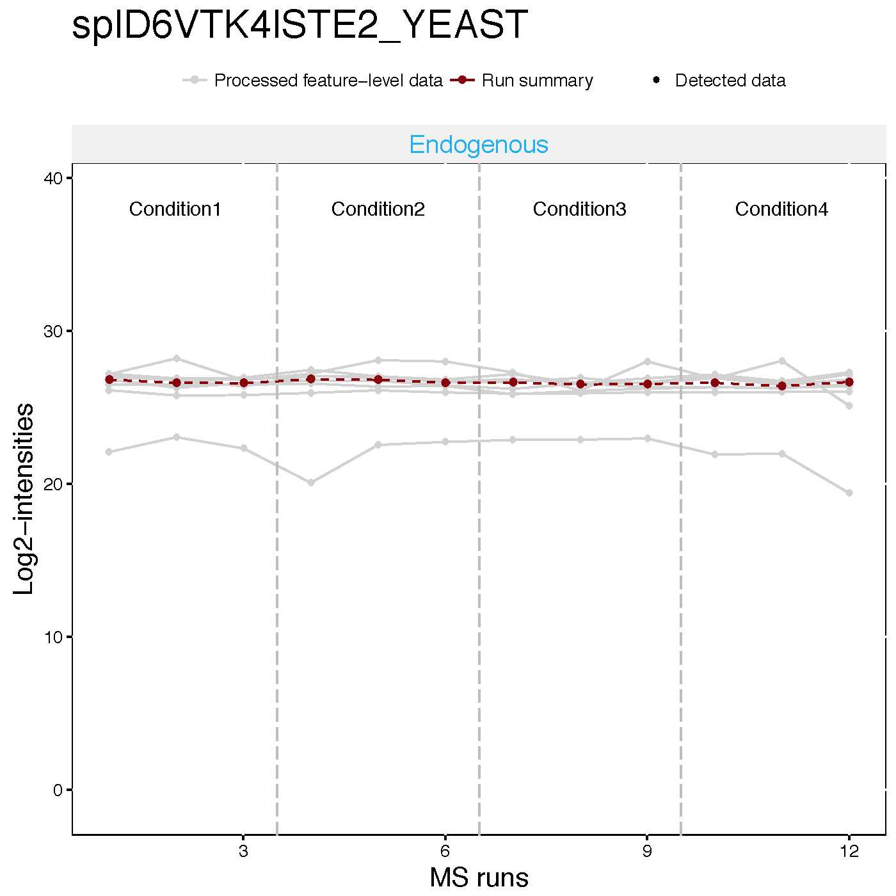
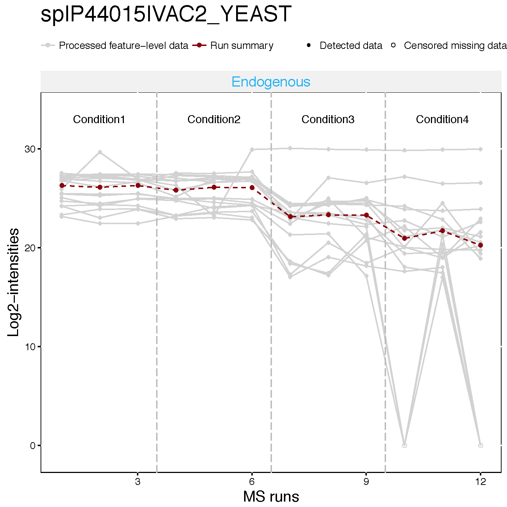
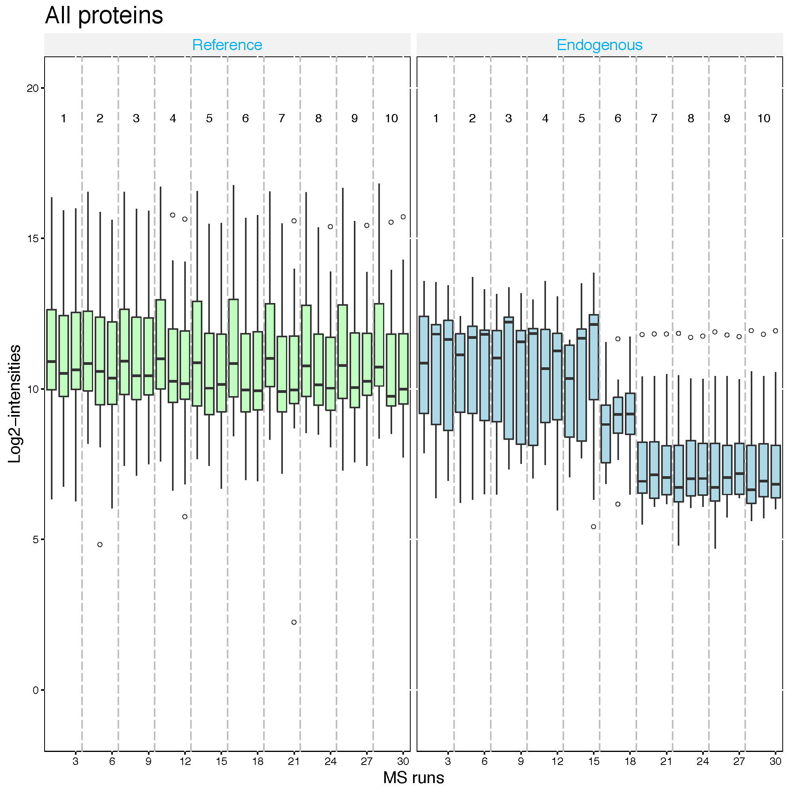
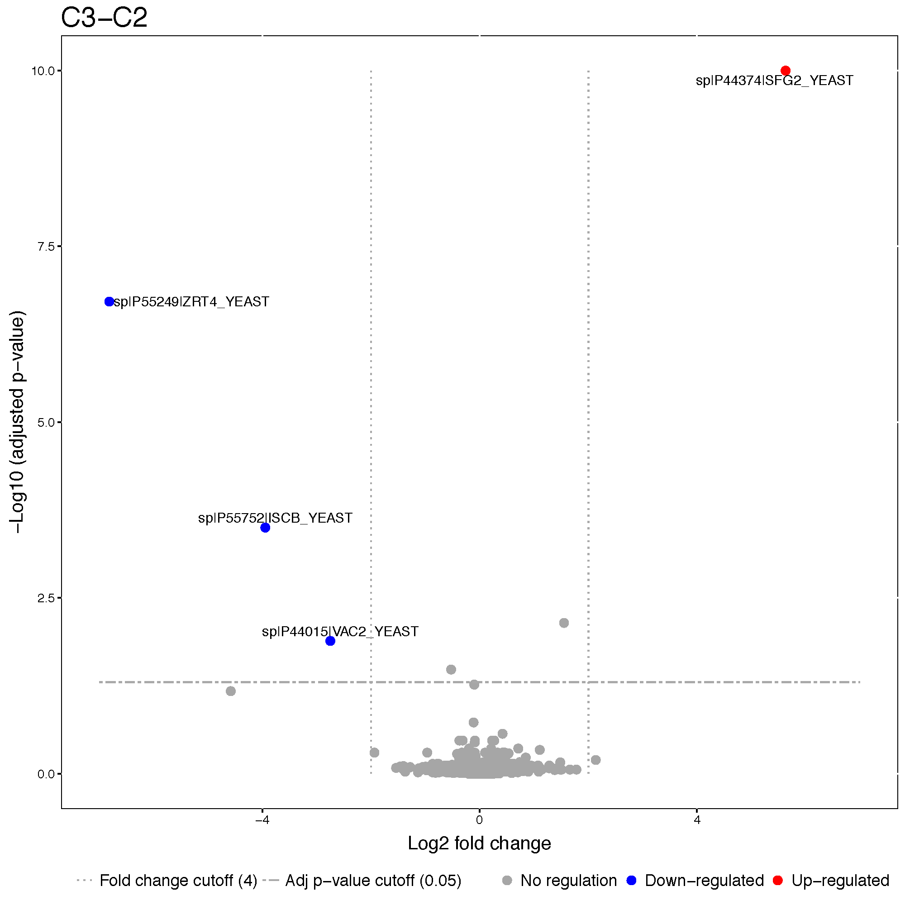
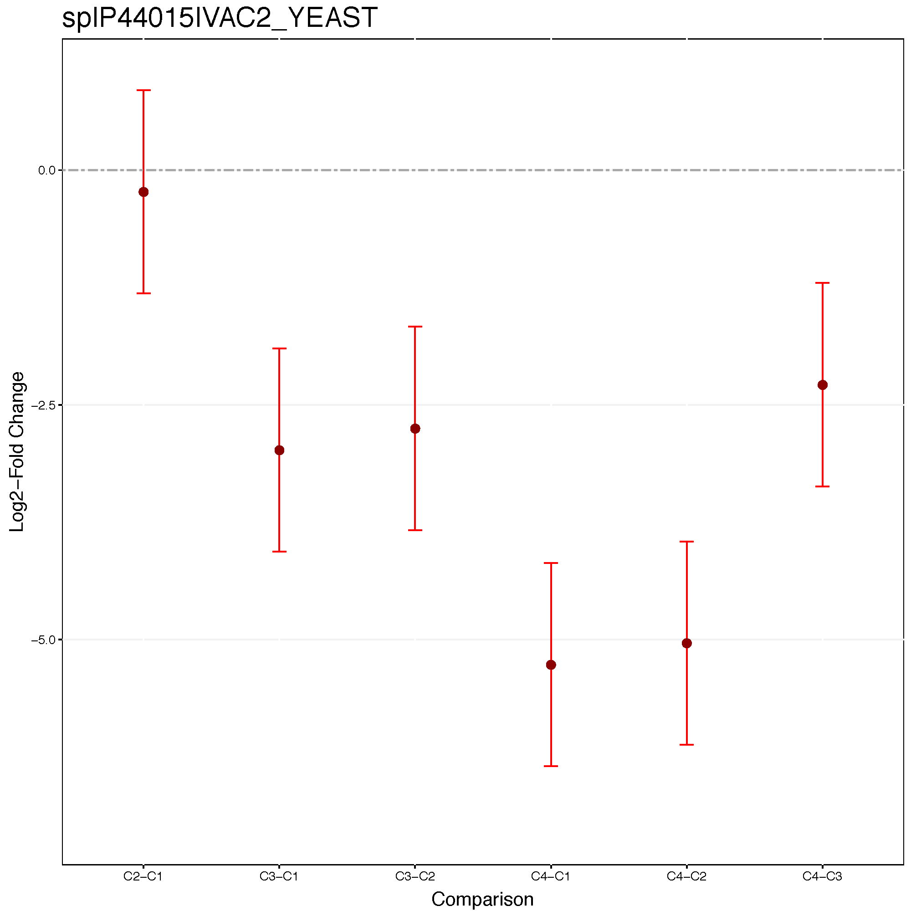
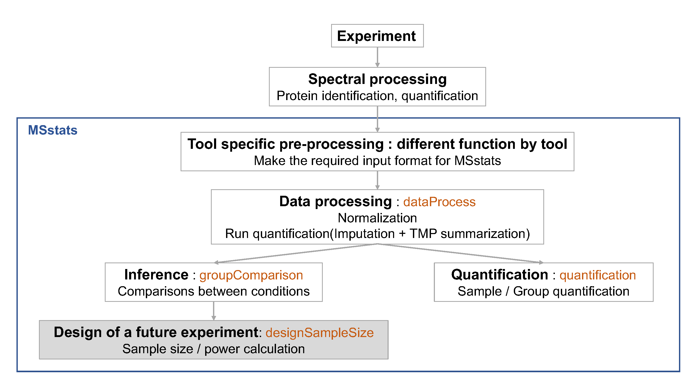
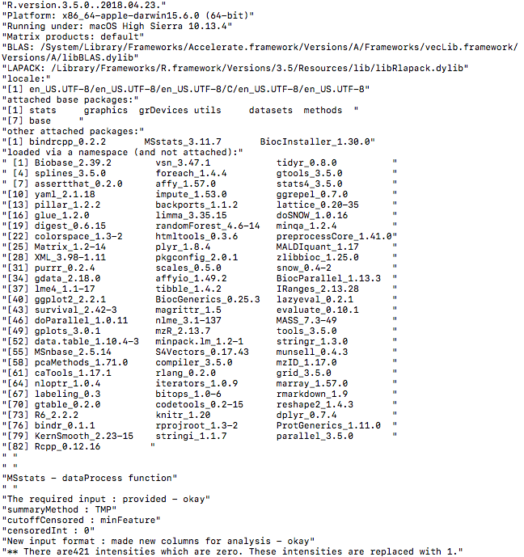

# Section 8 : MSstats
## introduction to data and preprocessing

### Objective

- Preprocessing steps to make required input format for MSstats from output from diverse output of spectral processing tools.
- Make annotation file, based on experimental design.


***

### Workflow in MSstats




***


### Data
- the quantified peak intensities data from ABRF 2015, processed by Skyline.

{width=70%}


***

### Load MSstats

Load MSstats first. Then you are ready to start MSstats. 

```{r, eval=F, echo=T, warning=F}
library(MSstats)
?MSstats
```

```{r, eval=T, echo=F, warning=F}
#library(MSstats, warn.conflicts = F, quietly = T, verbose = F)
library(MSstats)

?MSstats
```


***

### Allowable data formats

`MSstats` performs statistical analysis steps, that follow peak identification and quantitation. Therefore, input
to MSstats is the output of other software tools (such as `Skyline`, `MaxQuant` and so on) that read raw spectral files
, identify and quantify spectral peaks. The preferred structure of data for use in MSstats is a .csv file
in a *long* format with at least 10 columns representing the following variables: **ProteinName**, **PeptideSequence**, **PrecursorCharge**, **FragmentIon**, **ProductCharge**, **IsotopeLabelType**, **Condition**, **BioReplicate**, **Run**, **Intensity**. The variable names are fixed, but are case-insensitive.

```{r, eval=T, echo=F, warning=F}
head(DDARawData)
```

***

### Convert to MSstats required format (Data cleaning)

***
Let's start preprocessing steps to make required input format for MSstats from output from diverse output of spectral processing tools.


- Data input support for various data acquisition methods : DDA, DIA, SRM

- Interoperability with existing computational tools :
      - Converter functions for 7 data processin tools : 
      `SkylinetoMSstatsFormat`, `MaxQtoMSstatsFormat`, `OpenMStoMSstatsFormat`, `ProgenesistoMSstatsFormat`, `PDtoMSstatsFormat`, `SpectronauttoMSstatsFormat`, `OpenSWATHtoMSstatsFormat`, `DIAUmpiretoMSstatsFormat`
      - Consistent data cleaning steps across converter functions : filter multiple measurements, shared peptides, etc.
      - Generate the same format of data from diverse type of data format.


#### Skyline output

##### Read data

The required input data is generated automatically when using `MSstats` report format in `Skyline`.
We first load and access the dataset processed by `Skyline`. The name of saved file from `Skyline` using `MSstats report format` is *'ABRF2015_Skyline_report.csv'*. or you can use the published data from this link (https://panoramaweb.org/labkey/project/MacCoss/brendan/manuscripts/iPRG%202015/begin.view). This example dataset is the exactly same data in 'iPRG_10ppm_2rt_15cut_nosingle.csv' from the link above.


```{r}
# Read output from skyline 
raw.skyline <- read.csv(file="data/data_Skyline/ABRF2015_Skyline_report.csv")
```

```{r}
# Check the first 6 rows of dataset
head(raw.skyline)
```

There are some column named differently than required input. The information for `Condition` and `BioReplicate` is missing. Let's do preliminary check for this input.

```{r}
# total number of unique protein name
length(unique(raw.skyline$Protein))

# several isotopic peaks for peptide charge
unique(raw.skyline$FragmentIon)

# unique FileName, which is MS run.
unique(raw.skyline$FileName)

# 'Truncated' column
unique(raw.skyline$Truncated)

# count table for 'Truncated' column
xtabs(~Truncated, raw.skyline)

# count which 'Truncated' is 'True'
sum(raw.skyline$Truncated == 'True')
```


##### Set annotation file

Annotation information is required to fill in **Condition** and **BioReplicate** for corresponding **Run** information. Users have to prepare as csv or txt file like 'ABRF2015_Skyline_annotation.csv', which includes **Run**, **Condition**, and **BioReplicate** information, and load it in R.

```{r}
annot.skyline <- read.csv(file="data/data_Skyline/ABRF2015_Skyline_annotation.csv")
annot.skyline
```


###### Common mistake for annotation file : Incorrect Run information

Raw file name in the output of spectral processing tool is commonly long. We can make a typo in annotation file. If Raw file name and Run information are not matched, 

Let's check whether **Run** information is same as **File.Name** in output of `Skyline`.

```{r}
setdiff(unique(raw.skyline$FileName), annot.skyline$Run)
setdiff(annot.skyline$Run, unique(raw.skyline$FileName))
```
There is no issue in this annotation. 

Let's try the example with unmatched information.

```{r}
annot.wrong <- read.csv(file="data/data_Skyline/ABRF2015_Skyline_annotation_wrong_example.csv")
annot.wrong
```

**Note!** small details : hyphen vs underline.

###### Common mistake for annotation file : Incorrect `BioReplicate` information

`MSstats` distinguish the design of experiment as group comparison, time course, paired design, with the combination of `Condition`, `BioReplicate`, and `Run`.


###### Group comparison 
{width=40%}

In a group comparison design, the conditions (e.g., disease states) are profiled across **non-overlapping sets of biological replicates (i.e., subjects)**. In this example there are 2 conditions, Disease and Control (in general the number of conditions can vary). There are 3 subjects (i.e., biological replicates) per condition (in general an equal number of replicates per condition is not required). Overall, in this example there are 2 × 3 = 6 mass spectrometry runs.

The most important is that 1) subject IDs for disease group are completely different thatn subject IDs for control group 2) `Run` is not order of spectral acquisition, but just unique MS run ID.


In addition, if each subject has e technical replicate runs (in general technical replicates are not required, and their number per sample may vary). there are 2 × 3 × 3 = 18 mass spectrometry runs.

###### Time course

The important feature of a time course experimental design is that **a same subject (i.e., biological replicate) is repetitively measured across multiple time points**. In this example there are 3 time points, Time1, Time2, and Time3 (in general the number of times can vary). There are 3 subjects (i.e., biological replicates) measured across times (in general an equal number of times per replicate is not required). There are no technical replicates (in general the number of technical replicates per sample may vary). Overall, in this example there are 3 × 3 = 9 mass spectrometry runs.

{width=60%}

###### Paired design

Another frequently used experimental design is a *paired design*, where measurements from **multiple conditions (such as healthy biopsy and disease biopsy) are taken from a same subject**. The statistical model for this experimental design is the same as in the time course experiment, however the values in the columns of the input data may have a different appearence. In this example there are 3 subjects (in general the number of patients can vary). There are three  conditions per subject (in general the number of conditions per subject can exceed two). Overall, in this example there are $2  \times 3 = 6$ mass spectrometry runs. `BioReplicate` should indicate each individual ID.

{width=60%}

##### Preprocessing with `SkylinetoMSstatsFormat`

The input data for `MSstats` is required to contain variables of **ProteinName**, **PeptideSequence**, **PrecursorCharge**, **FragmentIon**, **ProductCharge**, **IsotopeLabelType**, **Condition**, **BioReplicate**, **Run**, **Intensity**. These variable names should be fixed. `MSstats` input from Skyline adapts the column scheme of the dataset so that it fits `MSstats` input format. However there are several extra column names and also some of them need to be changed.  `SkylinetoMSstatsFormat` function helps pre-processing for making right format of MSstats input from Skyline output. For example, it renames some column name, and replace truncated peak intensities with NA. Another important step is to handle isotopic peaks before using `dataProcess`. The output from Skyline for DDA experiment has several measurements of peak area from the monoisotopic, M+1 and M+2 peaks. To get a robust measure of peptide intensity, we can sum over isotopic peaks per peptide or use the highest peak. Here we take a summation per peptide ion.

Here is the summary of pre-processing steps in `SkylinetoMSstatsFormat` function (in orange box below).


For further details, visit the help file using the following code.
```{r, eval=F}
?SkylinetoMSstatsFormat
```


```{r}
# reformating and pre-processing for Skyline output.
input.skyline <- SkylinetoMSstatsFormat(raw.skyline, 
                                        annotation=annot.skyline,
                                        removeProtein_with1Feature = TRUE)
head(input.skyline)
```

##### Preliminary check

```{r}
length(unique(input.skyline$ProteinName)) 
sum(is.na(input.skyline$Intensity)) 
sum(!is.na(input.skyline$Intensity) & input.skyline$Intensity==0)
```


***

#### MaxQuant output

##### Read data

Three files should be prepared before MSstats. Two files, ‘proteinGroups.txt’ and ‘evidence.txt’ are outputs
from MaxQuant.

```{r}
# First, get protein ID information
proteinGroups <- read.table("data/data_MaxQuant/proteinGroups.txt", sep = "\t", header = TRUE)
```

```{r}
# Read in MaxQuant file: evidence.txt
evi <- read.table("data/data_MaxQuant/evidence.txt", sep="\t", header=TRUE)
colnames(evi)
unique(evi$Raw.file)
```

One file is for annotation information, required to fill in Condition and BioReplicate for corresponding Run information. Users have to prepare as csv or txt file like ‘ABRF2015_MaxQuant_annotation.csv’, which includes **Run**, **Condition**, and **BioReplicate** information, and load it in R.


##### Set annotation file

Annotation information is required to fill in **Condition** and **BioReplicate** for corresponding **Raw.file** information. Users have to prepare as csv or txt file like 'ABRF2015_MaxQuant_annotation.csv', which includes **Raw.file**, **Condition**, and **BioReplicate** information, and load it in R. **Raw.file** column in the annotation file should be the same as unique **Raw.file** in evidence.txt file.

```{r}
# Read in annotation including condition and biological replicates: annotation.csv
annot.maxquant <- read.csv("data/data_MaxQuant/ABRF2015_MaxQuant_annotation.csv", header = TRUE)
annot.maxquant
```


##### Preprocessing with `MaxQtoMSstatsFormat`

`MaxQtoMSstatsFormat` function helps pre-processing for making right format of MSstats input from MaxQuant output. Basically, this function gets peptide ion intensity from `‘evidence.txt’` file. In addition, there are several steps to filter out or to modify the data in order to get required information.

Here is the summary of pre-processing steps in `MaxQtoMSstatsFormat` function (in orange box below).



```{r, eval=F}
?MaxQtoMSstatsFormat
```

```{r}
# reformating and pre-processing for MaxQuant output.
# no protein with 1 peptide
input.maxquant <- MaxQtoMSstatsFormat(evidence=evi, 
                                      annotation=annot.maxquant,
                                      proteinGroups=proteinGroups,
                                      removeProtein_with1Peptide=TRUE)
head(input.maxquant)
```


##### Preliminary check

```{r}
length(unique(input.maxquant$ProteinName)) 
sum(is.na(input.maxquant$Intensity)) 
sum(!is.na(input.maxquant$Intensity) & input.maxquant$Intensity==0)
```

> Challenge
> 
> * Let's check unique information for `Run`,`BioReplicate` and `Condition` in `input.maxquant`.

```{r}
unique(input.maxquant[, c('Run', 'BioReplicate', 'Condition')])
```


***

#### OpenMS output

##### Read data

```{r}
# First, read output of OpenMS
raw.openMS <- read.csv("data/data_OpenMS/ABRF2015_OpenMS_raw.csv", stringsAsFactors=F) # the data file
head(raw.openMS)
```


##### Set annotation file

The output from `OpenMS` already includes `Run`, `BioReplicate`, `Condition` information. Let's check it.

```{r}
unique(raw.openMS[, c('Run', 'BioReplicate', 'Condition')])
```

##### Preprocessing with `OpenMStoMSstatsFormat`

There are several steps to filter out or to modify the data in order to get required information.
Here is the summary of pre-processing steps in `OpenMStoMSstatsFormat` function.


```{r, eval=F}
?OpenMStoMSstatsFormat
```

```{r}
# reformating and pre-processing for OpenMS output.
input.openms <- OpenMStoMSstatsFormat(raw.openMS,
                                      removeProtein_with1Feature=TRUE)

## now 'input.openms' is ready for MSstats
head(input.openms)
```


##### Preliminary check for preprocessed data

```{r}
length(unique(input.openms$ProteinName)) 
sum(is.na(input.openms$Intensity)) 
sum(!is.na(input.openms$Intensity) & input.openms$Intensity==0)
table(input.openms$Run)
```

> Challenge
> 
> * Let's check unique information for `Run`,`BioReplicate` and `Condition`.

```{r}
unique(input.openms[, c('Run', 'BioReplicate', 'Condition')]) 
```

***

#### Progenesis output

##### Read data

```{r}
# First, read output of Progenesis
raw.progenesis <- read.csv("data/data_Progenesis/ABRF2015_Progenesis_raw.csv", stringsAsFactors=F) # the data file
head(raw.progenesis)
```

One file is for annotation information, required to fill in Condition and BioReplicate for corresponding Run information. Users have to prepare as csv or txt file like ‘ABRF2015_Progenesis_annotation.csv’, which includes **Run**, **Condition**, and **BioReplicate** information, and load it in R.

##### Set annotation file

Annotation information is required to fill in **Condition** and **BioReplicate** for corresponding **Run** information. Users have to prepare as csv or txt file like 'ABRF2015_Progenesis_annotation.csv', which includes **Run**, **Condition**, and **BioReplicate** information, and load it in R.

```{r}
## Read in annotation including condition and biological replicates: ABRF2015_Progenesis_annotation.csv
annot.progenesis <- read.csv("data/data_Progenesis/ABRF2015_Progenesis_annotation.csv", header = TRUE)
annot.progenesis
```
!! `Run` information should be the same as annotated in output of `Progenesis`.


##### Preprocessing with `ProgenesistoMSstatsFormat`

The output from `Progenesis` includes peptide ion-level quantification for each MS runs. `ProgenesistoMSstatsFormat` function helps pre-processing for making right format of `MSstats` input from `Progenesis` output. Basically, this function reformats wide format to long format. It provide **Raw.abundance**, **Normalized.abundance** and **Spectral count** columns. This converter uses **Raw.abundance** columns for Intensity values. In addition, there are several steps to filter out or to modify the data in order to get required information.
Here is the summary of pre-processing steps in `ProgenesistoMSstatsFormat` function (in orange box below).


```{r, eval=F}
?ProgenesistoMSstatsFormat
```

```{r}
# reformating and pre-processing for Progenesis output.
input.progenesis <- ProgenesistoMSstatsFormat(raw.progenesis, 
                                              annotation=annot.progenesis,
                                              removeProtein_with1Peptide=TRUE)

## now 'input.progenesis' is ready for MSstats
head(input.progenesis)
```


##### Preliminary check for preprocessed data

```{r}
length(unique(input.progenesis$ProteinName)) 
sum(is.na(input.progenesis$Intensity)) 
sum(!is.na(input.progenesis$Intensity) & input.progenesis$Intensity==0)
table(input.progenesis$Run)
```

> Challenge
> 
> * Let's check unique information for `Run`,`BioReplicate` and `Condition`.

```{r}
unique(input.progenesis[, c('Run', 'BioReplicate', 'Condition')]) 
```

***


### Save your work

We can save the data that we made so far.

```{r}
save(input.skyline, file='data/data_Skyline/input.skyline.rda')
save(input.maxquant, file='data/data_MaxQuant/input.maxquant.rda')
save(input.openms, file='data/data_OpenMS/input.openms.rda')
save(input.progenesis, file='data/data_Progenesis/input.progenesis.rda')

```


***
## Data processing - Normalization and run summarization


### dataProcess with Skyline data

Let's start processing steps. It includes log transformation of intensities, normalization and run-level summarization.


#### Load the pre-processed data of Skyline output

```{r, echo=T}
load(file='data/data_Skyline/input.skyline.rda')
```


#### Normalizing and summarizing data with dataProcess
**! Always pay attention to the default options **  

To get started with this function, visit the help section of `dataProcess` first: 

```{r,eval=FALSE}
?dataProcess
```

##### Default normalization and summarization options

`dataProcess` perform (1) normalization first. The default option for normalization is `equalizeMedians`. `equalizeMedians' fits for label-based SRM experiments, which we can use reference signals. There are three more options for normalization. Depending on the suitable assumption for your experiment, you can choose one of them.

Then, (2) run level summarization will be performed including missing value imputation by accerelated failure model and robust parameter estimation by TMP (Tukey's median polish).

Below show the default for all options in dataProcess except `censoredInt`. `censoredInt='0'` should be used for Skyline output.

```{r, eval=F, message=F, warning=F}
quant.skyline <- dataProcess(raw = input.skyline, 
                             logTrans=2, 
                             normalization = 'equalizeMedians',
                             summaryMethod = 'TMP', 
                             MBimpute=TRUE,
                             censoredInt='0',
                             cutoffCensored='minFeature',
                             maxQuantileforCensored = 0.999)
```

```{r, echo=F, eval=F, echo=F, message=F, warning=F}
save(quant.skyline, file='data/data_skyline/quant.skyline.RData')
```

```{r, echo=F, message=F, warning=F}
load('data/data_Skyline/quant.skyline.rda')
```


Let's check output from `dataProcess`.

```{r, eval=T, echo=T}
# show the name of outputs
names(quant.skyline)

# show reformated and normalized data.
# 'ABUNDANCE' column has normalized log2 transformed intensities.
head(quant.skyline$ProcessedData)

# This table includes run-level summarized log2 intensities. (column : LogIntensities)
# Now one summarized log2 intensities per Protein and Run.
# NumMeasuredFeature : show how many features are used for run-level summarization.
#         If there is no missing value, it should be the number of features in certain protein.
# MissingPercentage : the number of missing features / the number of features in certain protein.
head(quant.skyline$RunlevelData)

# show which summarization method is used.
head(quant.skyline$SummaryMethod)
```


***

#### Visualization of processed data

##### Quality control plots

Now let's look at what the equalize medians procedure did to our data. QC plot is good to see the distribution of intensities per MS run and outliers. So, it is good visualization to check normalization. However, not good to see individual intensities.

```{r, eval=F, message=F, warning=F}
# QC plot for normalized data with equalize median method
dataProcessPlots(data = quant.skyline, 
                 type="QCplot", 
                 width=7, height=7,
                 which.Protein = 'allonly',
                 address='data/data_Skyline/ABRF_skyline_equalizeNorm_')
```
Then, `ABRF_skyline_equalizeNorm_QCPlot.pdf` are generated in the currect directory.

{width=50%}


Now the median log2 intensities per run across MS runs (lines in the boxes) are the same. 


##### Profile plots

Profile plot is good visualization to check individual measurements. Each dot means one intensity. The dots are linked with line per feature. If line is disconnected, that means there is no value (missing value). Color means different peptides and charge stages. Different line type means different transition. 


```{r, eval=F}
# if you have many MS runs, adjust width of plot (makd wider)
# Profile plot for the data with equalized median method
dataProcessPlots(data = quant.skyline, 
                 type="Profileplot", 
                 width=7, height=7,
                 address="data/data_Skyline/ABRF_skyline_equalizeNorm_")
```

`ABRF_skyline_equalizeNorm_ProfilePlot.pdf` and `ABRF_skyline_equalizeNorm_ProfilePlot_wSummarization.pdf` are generated in the current directory.

Then, Let's go though profile plots to see overall quality of data.

There are two pdfs for each protein, first is profile plot with normalized data and second plot is profile plot with normalilzed data and summarized data. This profile plot shows each peptide transition across runs, grouped per condition. Ech peptide has a different colour/type layout. 

{width=50%}


This plot shows The panel on the right shows the same transitions in grey, with the values as summarized by the model overlayed in red.


{width=50%}


Instead of making all profile plots for all proteins, we can make plot for individual protein.
Here is the example of spike-in protein, `sp|P44015|VAC2_YEAST`
```{r, eval=FALSE}
dataProcessPlots(data = quant.skyline, 
                 type="Profileplot", 
                 featureName="NA",
                 width=7, height=7,
                 which.Protein = 'sp|P44015|VAC2_YEAST',
                 address="data/data_Skyline/ABRF_skyline_equalizeNorm_P44015_")
```

{width=50%}


{width=50%}


##### Condition plots

Condition plots illustrate the systematic difference between conditions. The dots indicates the mean of all summarized intensities in each condition and default error bar is CI with 0.95 significant level. However, it is not related with model-based analysis.


```{r, eval=F}
dataProcessPlots(data = quant.skyline, 
                 type="conditionplot", 
                 width=7, height=7,
                 address="data/data_Skyline/ABRF_skyline_equalizeNorm_")
```

We can draw the condition plot for a protein, `sp|P44015|VAC2_YEAST` .

```{r, eval=F}
dataProcessPlots(data = quant.skyline, 
                 type="conditionplot", 
                 width=7, height=7,
                 which.Protein = 'sp|P44015|VAC2_YEAST',
                 address="data/data_Skyline/ABRF_skyline_equalizeNorm_P44015_")
```


{width=50%}


> Challenge
>
> This is the study design. Let's check visualization for other 5 spike-in proteins.
> 1. sp|P55752|ISCB_YEAST
> 2. sp|P44374|SFG2_YEAST
> 3. sp|P44983|UTR6_YEAST
> 4. sp|P44683|PGA4_YEAST
> 5. sp|P55249|ZRT4_YEAST

{width=50%}


***

#### Different normalization option
Let's see the different normalization effect with SRM dataset including two proteins

```{r}
head(SRMRawData)
unique(SRMRawData$ProteinName)
```

##### No normalization
No normalization is performed. If you had your own normalization before `MSstats`, you should use like below.
```{r, eval=FALSE}
srm.nonorm <- dataProcess(SRMRawData, normalization=FALSE)
dataProcessPlots(srm.nonorm, type='QCplot', address='srm_noNorm_')
```

{width=50%}

##### Equalize medians normalization
The default option for normalization is 'equalizeMedians', where all the
intensities in a run are shifted by a constant, to equalize the median of intensities across runs for
label-free experiment. This normalization method is appropriate **when we can assume that the
majority of proteins do not change across runs**. Be cautious when using the `equalizeMedians`
option for a label-free DDA dataset with only a small number of proteins. For label based experiment,
`equalizeMedians` equalizes the median of reference intensities across runs and is generally proper
even for a dataset with a small number of proteins.

```{r, eval=FALSE}
srm.equalmed <- dataProcess(SRMRawData, normalization = 'equalizeMedians')
dataProcessPlots(srm.equalmed, type='QCplot', address='srm_equalM_')
```

{width=50%}

##### Quantile normalization
The distribution of all the intensities in each run will become the same across runs for
label-free experiment. For label-based experiment, the distribution of all the reference intensities
will be become the same across runs and all the endogenous intensities are shifted by a constant
corresponding to reference intensities.

```{r, eval=FALSE}
srm.quantile <- dataProcess(SRMRawData, normalization='quantile')
dataProcessPlots(srm.quantile, type='QCplot', address='srm_quantile_')
```

{width=50%}

##### Global standards normalization : example 1
If you have a spiked in standard across all MS runs, you may set this to `globalStandards` and define the standard with `nameStandards` option. Global standard peptide or Protein names, which you can assume that they have the same abundance across MS runs, should be assigned in the vector for this option.

First, let's assume that `PMG2` proteins is the spike-in protein and shoule be equal amount across MS runs.

```{r, eval=FALSE}
srm.global.pmg2 <- dataProcess(SRMRawData, normalization ='globalStandards',
                               nameStandards = 'PMG2')
dataProcessPlots(srm.global.pmg2, type='QCplot', address='srm_global_PMG2_')
```
{width=50%}


Second, let's assume that `IDHC` proteins is the spike-in protein and shoule be equal amount across MS runs.

##### Global standards normalization : example 2
```{r, eval=FALSE}
srm.global.idhc <- dataProcess(SRMRawData, normalization ='globalStandards',
                               nameStandards = 'IDHC')
dataProcessPlots(srm.global.idhc, type='QCplot', address='srm_global_IDHC_')
```
{width=50%}


#### Different summarization option

Here is the summary of combinations for imputation options with summaryMethod='TMP'.

* MBimpute=TRUE : AFT model-based imputation using `cutoffCensored` value in the AFT model.

* The default option for `cutoffCensored` is `minFeature`, taking the minimum value for the corresponding
feature. With this option, those runs with substantial missing measurements will be biased by
the cutoff value. In such case, you may remove the runs that have more than 50% missing values from the
analysis with the option remove50missing=TRUE.

* In case that there are completely missing measurements in a run for a protein, any imputation
will not be performed.

##### No imputation, TMP summarization only

```{r, eval=F, message=F, warning=F}
quant.skyline.TMPonly <- dataProcess(raw = input.skyline, 
                                      logTrans=2, 
                                      summaryMethod = 'TMP', 
                                      MBimpute=FALSE, ##
                                      censoredInt='0',
                                      cutoffCensored='minFeature',
                                      maxQuantileforCensored = 0.999)
```

```{r, echo=F, message=F, warning=F}
load('data/data_Skyline/quant.skyline.TMPonly.rda')
```

The column, `censored`, is not in the processed data any more.
```{r}
head(quant.skyline.TMPonly$ProcessedData)
```


***
### dataProcess with MaxQuant data

```{r, echo=T}
load(file='data/data_MaxQuant/input.maxquant.rda')
```

```{r}
head(input.maxquant)
sum(is.na(input.maxquant$Intensity)) 
sum(!is.na(input.maxquant$Intensity) & input.maxquant$Intensity==0)
```

**Note!** MaxQuant output has only `NA`. **censoredInt='NA'** should be used for MaxQuant output.

> Challenges
>
> 1. Try `dataProcess` with equalize median normalization for MaxQuant output. (`input.maxquant.rda` from section 1)

<details>
```{r, echo=T, eval=F, message=F, warning=F}
quant.maxquant <- dataProcess(raw = input.maxquant, 
                                      logTrans=2, 
                                      #normalization = 'quantile',
                                      summaryMethod = 'TMP', 
                                      MBimpute=TRUE,
                                      censoredInt='NA',
                                      cutoffCensored='minFeature',
                                      maxQuantileforCensored = 0.999)
```
</details>

> 2. Try `dataProcess` with quantile normalization for MaxQuant output. (`input.maxquant.rda` from section 1)

<details>
```{r, echo=T, eval=F, message=F, warning=F}
quant.maxquant.quantile <- dataProcess(raw = input.maxquant, 
                              logTrans=2, 
                              normalization = 'quantile',
                              summaryMethod = 'TMP', 
                              MBimpute=TRUE,
                              censoredInt='NA',
                              cutoffCensored='minFeature',
                              maxQuantileforCensored = 0.999)
```
</details>

> 3. Draw QC plots for both cases above and compare.

<details>
```{r, echo=T, eval=F, message=F, warning=F}
dataProcessPlots(data = quant.maxquant, 
                 type="QCplot", 
                 width=7, height=7,
                 which.Protein = 'allonly',
                 address='data/data_MaxQuant/ABRF_maxquant_equalMed_')

dataProcessPlots(data = quant.maxquant.quantile, 
                 type="QCplot", 
                 width=7, height=7,
                 which.Protein = 'allonly',
                 address='data/data_MaxQuant/ABRF_maxquant_quantile_')
```
</details>

> 4. Draw Profile plots of protein `P55249`, for both cases above and compare.

<details>
```{r, echo=T, eval=F, message=F, warning=F}
dataProcessPlots(data = quant.maxquant, 
                 type="Profileplot", 
                 featureName="NA",
                 width=7, height=7,
                 which.Protein = 'P55249',
                 address="data/data_MaxQuant/ABRF_maxquant_equalMed_P55249_")

dataProcessPlots(data = quant.maxquant.quantile, 
                 type="Profileplot", 
                 featureName="NA",
                 width=7, height=7,
                 which.Protein = 'P55249',
                 address="data/data_MaxQuant/ABRF_maxquant_quantile_P55249_")
```
</details>

***
### dataProcess with OpenMS data

```{r, echo=T}
load(file='data/data_OpenMS/input.openms.rda')
```

```{r}
head(input.openms)
sum(is.na(input.openms$Intensity)) 
sum(!is.na(input.openms$Intensity) & input.openms$Intensity==0)
```

**Note!** OpenMS output has only `NA`. **censoredInt='NA'** should be used for OpenMS output.

> Challenges
>
> 1. Try `dataProcess` with equalize normalization for OpenMS output. (`input.openms.rda` from section 1)

<details>
```{r, echo=T, eval=F, message=F, warning=F}
quant.openms <- dataProcess(raw = input.openms, 
                              logTrans=2, 
                              #normalization = 'quantile',
                              summaryMethod = 'TMP', 
                              MBimpute=TRUE,
                              censoredInt='NA',
                              cutoffCensored='minFeature',
                              maxQuantileforCensored = 0.999)
```
</details>

> 2. Try `dataProcess` with quantile normalization for OpenMS output. (`input.openms.rda` from section 1)

<details>
```{r, echo=T, eval=F, message=F, warning=F}
quant.openms.quantile <- dataProcess(raw = input.openms, 
                                       logTrans=2, 
                                       normalization = 'quantile',
                                       summaryMethod = 'TMP', 
                                       MBimpute=TRUE,
                                       censoredInt='NA',
                                       cutoffCensored='minFeature',
                                       maxQuantileforCensored = 0.999)
```
</details>

> 3. Draw Profile plots of protein `sp|P55249|ZRT4_YEAST`, for both cases above and compare.

<details>
```{r, echo=T, eval=F, message=F, warning=F}
dataProcessPlots(data = quant.openms, 
                 type="Profileplot", 
                 featureName="NA",
                 width=7, height=7,
                 which.Protein = 'sp|P55249|ZRT4_YEAST',
                 address="data/data_OpenMS/ABRF_openms_equalMed_P55249_")

dataProcessPlots(data = quant.openms.quantile, 
                 type="Profileplot", 
                 featureName="NA",
                 width=7, height=7,
                 which.Protein = 'sp|P55249|ZRT4_YEAST',
                 address="data/data_OpenMS/ABRF_openms_quantile_P55249_")
```
</details>

***
### dataProcess with Progenesis data

```{r, echo=T}
load(file='data/data_Progenesis/input.progenesis.rda')
```

```{r}
head(input.progenesis)
sum(is.na(input.progenesis$Intensity)) 
sum(!is.na(input.progenesis$Intensity) & input.progenesis$Intensity==0)
```

**Note!** Progenesis output has only `0`. **censoredInt='0'** should be used for Progenesis output.

> Challenges
>
> 1. Try `dataProcess` with equalize normalization for Progenesis output. (`input.progenesis.rda` from section 1)

<details>
```{r, echo=T, eval=F, message=F, warning=F}
quant.progenesis <- dataProcess(raw = input.progenesis, 
                              logTrans=2, 
                              #normalization = 'quantile',
                              summaryMethod = 'TMP', 
                              MBimpute=TRUE,
                              censoredInt='0',
                              cutoffCensored='minFeature',
                              maxQuantileforCensored = 0.999)
```
</details>

> 2. Try `dataProcess` with quantile normalization for Progenesis output. (`input.progenesis.rda` from section 1)

<details>
```{r, echo=T, eval=F, message=F, warning=F}
quant.progenesis.quantile <- dataProcess(raw = input.progenesis, 
                                       logTrans=2, 
                                       normalization = 'quantile',
                                       summaryMethod = 'TMP', 
                                       MBimpute=TRUE,
                                       censoredInt='0',
                                       cutoffCensored='minFeature',
                                       maxQuantileforCensored = 0.999)
```
</details>

> 3. Draw Profile plots of protein `sp|P55249|ZRT4_YEAST`, for both cases above and compare.

<details>
```{r, echo=T, eval=F, message=F, warning=F}
dataProcessPlots(data = quant.progenesis, 
                 type="Profileplot", 
                 featureName="NA",
                 width=7, height=7,
                 which.Protein = 'sp|P55249|ZRT4_YEAST',
                 address="data/data_Progenesis/ABRF_progenesis_equalMed_P55249_")

dataProcessPlots(data = quant.progenesis.quantile, 
                 type="Profileplot", 
                 featureName="NA",
                 width=7, height=7,
                 which.Protein = 'sp|P55249|ZRT4_YEAST',
                 address="data/data_Progenesis/ABRF_progenesis_quantile_P55249_")
```
</details>

> 4. Compare profile plots from MaxQuant data.


***
## Differential abundance and sample size calculation

### Inference and future design of experiment with Skyline output

#### Load the processed data (output of `dataProcess`) of Skyline output

```{r, echo=T}
load(file='data/data_Skyline/quant.skyline.rda')
```


***
#### Finding differentially abundant proteins across conditions

{width=90%}


##### Assign contrast matrix

After we normalized the data and summarized each protein's behaviour across conditions in `dataProcess` step, we are all set to compare protein changes between groups of conditions. Within MSstats we can do this with the `groupComparison` function, which takes as input the output of the `dataProcess` function. 

```{r}
?groupComparison
```

We have to tell `groupComparison` which are the conditions we would like to compare.
You can make your `contrast.matrix` in R in a text editor. We define our contrast matrix by adding a column for every condition, **in alphabetical order**. We add a row for every comparison we would like to make between groups of conditions.  

**0** is for conditions we would like to ignore.
**1** is for conditions we would like to put in the numerator of the ratio or fold-change.
**-1** is for conditions we would like to put in the denumerator of the ratio or fold-change.

If you have multiple groups, you can assign any gruop comparisons you are interested in. For example, if you have 4 different conditions, Condition1, Condition2, Condition3, Condition4, there are many possible comparisons.

```{r, eval=TRUE}
# check unique conditions and check order of condition information
# In this case, Disease and Healthy
unique(quant.skyline$ProcessedData$GROUP_ORIGINAL)

comparison1<-matrix(c(-1,1,0,0),nrow=1)
comparison2<-matrix(c(-1,0,1,0),nrow=1)
comparison<-rbind(comparison1, comparison2)
row.names(comparison)<-c("C2-C1","C3-C1")

comparison
```

> Challenges
>
> Make the matrix, named `comparison`, for all 6 paired comparision among 4 conditions (condition1, condition2, condition3, condition4)

<details>
```{r, eval=TRUE}
unique(quant.skyline$ProcessedData$GROUP_ORIGINAL)

comparison1<-matrix(c(-1,1,0,0),nrow=1)
comparison2<-matrix(c(-1,0,1,0),nrow=1)
comparison3<-matrix(c(-1,0,0,1),nrow=1)
comparison4<-matrix(c(0,-1,1,0),nrow=1)
comparison5<-matrix(c(0,-1,0,1),nrow=1)
comparison6<-matrix(c(0,0,-1,1),nrow=1)
comparison<-rbind(comparison1, comparison2, comparison3, comparison4, comparison5, comparison6)
row.names(comparison)<-c("C2-C1","C3-C1","C4-C1","C3-C2","C4-C2","C4-C3")

comparison
```
</details>

##### Comparing conditions with `groupComparison` 

`groupComparison` uses the run-level summarized data (`$RunlevelData` from `dataProcess` function) for hypothesis testing.

```{r, eval=F, message=F, warning=F}
test.skyline <- groupComparison(contrast.matrix=comparison, data=quant.skyline)
```

```{r, echo=F}
load(file='data/data_Skyline/test.skyline.rda')
```

Let's check the output.

```{r, eval=TRUE}
class(test.skyline)

names(test.skyline)

# Show test result
# Label : which comparison is used
# log2FC : estimated log2 fold change between Diseased and Healthy
# adj.pvalue : adjusted p value
# issue : detect whether this protein has any issue for comparison
#    such as, there is measurement in certain group, or no measurement at all.
# MissingPercentage : the number of missing intensities/total number of intensities 
#     in conditions your are interested in for comparison
# ImputationPercentage : the number of imputed intensities/total number of intensities 
#     in conditions your are interested in for comparison
head(test.skyline$ComparisonResult)

# After fitting linear model, residuals and fitted values can be shown.
head(test.skyline$ModelQC)

# Fitted model per protein
head(test.skyline$fittedmodel)
test.skyline$fittedmodel[[1]]
```

##### Save the comparison result 

Let's save the testing result as rdata and .csv file.

```{r, eval=T, message=F, warning=F}
Skyline.result <- test.skyline$ComparisonResult

save(Skyline.result, file='data/data_Skyline/Skyline.result.rda')
write.csv(Skyline.result, file='data/data_Skyline/testResult_ABRF_skyline.csv')
```

##### subset of significant comparisons

Let's inspect the results to see what proteins are changing significantly between Diseased and Healthy.

```{r, eval=TRUE}
head(Skyline.result)

# select subset of rows with adj.pvalue < 0.05
SignificantProteins <- 
  Skyline.result[Skyline.result$adj.pvalue < 0.05, ]

nrow(SignificantProteins)

# select subset of rows with adj.pvalue < 0.05 and log2FC > 2
SignificantProteinsUpInDiseased <- SignificantProteins[SignificantProteins$log2FC > 2 ,]

nrow(SignificantProteinsUpInDiseased)
```


***

#### Visualization of differentially abundant proteins

```{r, eval=FALSE}
?groupComparisonPlots
```

##### Volcano plot

Volcano plots allow us to visually separate strong changes, which are not significant, from strong and significant changes. Look for these subjects in the upper right and upper left quadrants of the plot. Protein name will be shown only for siginificant proteins.

```{r, eval=F}
groupComparisonPlots(data = Skyline.result, 
                     type = 'VolcanoPlot',
                     address = 'data/data_Skyline/testResult_ABRF_skyline_')
```

{width=60%}

We can set up estimated fold change cutoff.

```{r, eval=F}
groupComparisonPlots(data = Skyline.result, 
                     type = 'VolcanoPlot',
                     sig = 0.05, 
                     FCcutoff = 2^2, 
                     address = 'data/data_Skyline/testResult_ABRF_skyline_FCcutoff4_')
```


{width=60%}

##### Comparison plot

Comparison plots illustrate model-based estimates of log-fold changes, and the associated
uncertainty, in several comparisons of conditions for one protein. X-axis is the comparison of
interest. Y-axis is the log fold change. The dots are the model-based estimates of log-fold
change, and the error bars are the model-based 95% confidence intervals (the option sig can
be used to change the significance level of significance). For simplicity, the confidence intervals
are adjusted for multiple comparisons within protein only, using the Bonferroni approach. For
proteins with N comparisons, the individual confidence intervals are at the level of 1-sig/N.


```{r, eval=F}
groupComparisonPlots(Skyline.result, 
                     type="ComparisonPlot", 
                     address="data/data_Skyline/testResult_ABRF_skyline_")
```


{width=60%}

Let's check the comparison result for protein `sp|P44015|VAC2_YEAST`.

```{r}
Skyline.result[Skyline.result$Protein == 'sp|P44015|VAC2_YEAST', ]
```


***

#### Planning future experimental designs


{width=90%}


This last analysis step views the dataset as a pilot study of a future experiment, utilizes its variance components, and calculates the minimal number of replicates required in a future
experiment to achieve the desired statistical power. The calculation is performed by the function `designSampleSize`, which takes as input the fitted model in `groupComparison`. Sample size calculation assumes same experimental design (i.e. group comparison, time course or paired design) as in the current dataset, and uses the model fit to estimate the median variance components across all the proteins. Finally, sample size calculation assumes that a large proportion of proteins (specifically, 99%) will not change in abundance in the future experiment. This assumption also provides conservative results.
Using the estimated variance components, the function relates the number of biological replicates per condition (`numSample`, rounded to 0 decimal), average statistical power across all the proteins (`power`), minimal fold change that we would like to detect (can be specified as a range, e.g. `desiredFC=c(1.1, 2)`), and the False Discovery Rate (`FDR`). The user should specify all these quantities but one, and the function will solve for the remainder. The quantity to solve for should be set to `= TRUE`.


```{r, eval=FALSE}
?designSampleSize
```


##### Calculating statistical power 

```{r, eval=T}
# calculate the power
test.power <- designSampleSize(data = test.skyline$fittedmodel, 
                               desiredFC = c(1.1, 1.6), 
                               FDR = 0.05,
                               power = TRUE,
                               numSample = 3)
test.power
```

##### Visualizing the relationship between desired fold-change and power

```{r, eval=T}
designSampleSizePlots(data = test.power)
```


##### Designing sample size for desired fold-change

```{r, eval=T}
# Minimal number of biological replicates per condition
samplesize <- designSampleSize(data = test.skyline$fittedmodel, 
                               desiredFC = c(1.1, 1.6), 
                               FDR = 0.05,
                               power = 0.9,
                               numSample = TRUE)
samplesize
```


##### Visualizing the relationship between desired fold-change and mininum sample size number

```{r, eval=T}
designSampleSizePlots(data = samplesize)
```


***

#### Protein subject quantification 

{width=90%}

If there is no technical replicate, subject (or sample) quantification should be the same as run-level summarization. If there are technical replicates, subjet-level summarization(quantification) with run-level summarization will be useful for downstream analysis, such as classification.

```{r, eval=FALSE}
?quantification
```

```{r}
sampleQuant <- quantification(quant.skyline)
head(sampleQuant)
```

```{r}
groupQuant <- quantification(quant.skyline, type='Group')
head(groupQuant)
```


***

#### msstats.log and sessionInfo.txt

These two files are important to keep the records of package versions and options in functions.

{width=90%}

***
### Inference and future design of experiment with Skyline output

>
> Challenges
>
> Load the processed data (output of dataProcess from section 2 of MaxQuant output and 1) find the differentially abundant comparisons using `groupComparison` with the same `comparison` matrix, 2) draw volcano plot with output of `groupComparison`, and 3) draw comparison plot with output of `groupComparison` with MaxQuant output. and Check the comparison plot for the protein, `P55249`. 

<details>
```{r, echo=T, eval=F}
load(file='data/data_MaxQuant/quant.maxquant.rda')

test.maxquant <- groupComparison(contrast.matrix=comparison, data=quant.maxquant)
MaxQuant.result <- test.maxquant$ComparisonResult
write.csv(MaxQuant.result, file='data/data_MaxQuant/testResult_ABRF_maxquant.csv')

groupComparisonPlots(data = MaxQuant.result, 
                     type = 'VolcanoPlot',
                     address = 'data/data_MaxQuant/testResult_ABRF_maxquant_')

groupComparisonPlots(data = MaxQuant.result, 
                     type = 'ComparisonPlot',
                     which.Protein = 'P55249',
                     address = 'data/data_MaxQuant/testResult_ABRF_maxquant_')
```
</details>

***
### Inference and future design of experiment with OpenMS output

>
> Challenges

> Load the processed data (output of dataProcess from section 2 of OpenMS output and 1) find the differentially abundant comparisons using `groupComparison` with the same `comparison` matrix, 2) draw volcano plot with output of `groupComparison`, and 3) draw comparison plot with output of `groupComparison` with OpenMS output. and Check the comparison plot for the protein, `sp|P55249|ZRT4_YEAST`. 

<details>
```{r, echo=T, eval=F}
load(file='data/data_OpenMS/quant.openms.rda')

test.openms <- groupComparison(contrast.matrix=comparison, data=quant.openms)
OpenMS.result <- test.openms$ComparisonResult
write.csv(OpenMS.result, file='data/data_OpenMS/testResult_ABRF_openms.csv')

groupComparisonPlots(data = MaxQuant.result, 
                     type = 'VolcanoPlot',
                     address = 'data/data_OpenMS/testResult_ABRF_openms_')

groupComparisonPlots(data = MaxQuant.result, 
                     type = 'ComparisonPlot',
                     which.Protein = 'sp|P55249|ZRT4_YEAST',
                     address = 'data/data_OpenMS/testResult_ABRF_openms_')
```
</details>


Here is the experimental design for ABRF 2015 study.
{width=70%}

