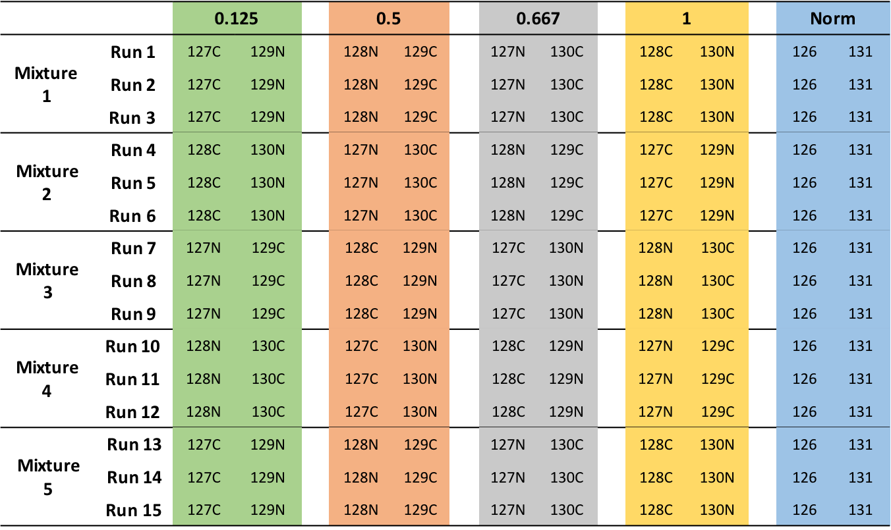
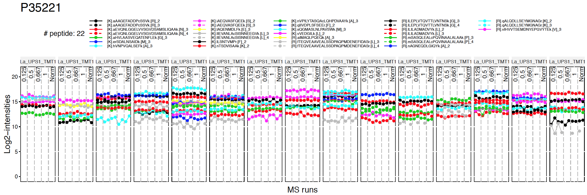

# Section 9: MSstatsTMT

## Introductioin to data and preprocessing

### Objective

- Preprocessing steps to make required input format for MSstatsTMT from output from diverse output of spectral processing and peptide quantification tools.
- Make annotation file, based on experimental design.


***

### Data
- Controlled mixtures: Sigma UPS1 48 protein-mix were spiked at 4 different ratio into a SILAC-labelled HeLa lysate. The mixtures were measured by TMT 10-plexes.

- the peptide quantification data of controlled mixtures, processed by Proteome Discoverer and MaxQuant.




***

### Load MSstatsTMT

Load MSstatsTMT first. Then you are ready to start MSstats. 

```{r, eval=T, echo=T, warning=F}
# install MSstatsTMT from bioconductor
# if (!requireNamespace("BiocManager", quietly = TRUE))
#     install.packages("BiocManager")
# BiocManager::install("MSstatsTMT")

library(MSstatsTMT) # make sure it is version 1.2.1
?MSstatsTMT
```


***

### Allowable data formats

`MSstatsTMT` performs statistical analysis steps, that follow peptide identification and quantitation. Therefore, input to MSstatsTMT is the output of other software tools (such as `Proteome Discoverer`, `MaxQuant` and so on) that read raw spectral files
, identify and quantify peptide ions. The preferred structure of data for use in MSstatsTMT is a .csv file in a *long* format with at least 10 columns representing the following variables: **ProteinName**, **PeptideSequence**, **Charge**, **PSM**, **Channel**, **Condition**, **BioReplicate**, **Mixture**,  **TechRepMixture**, **Intensity**. The variable names are fixed, but are case-insensitive.

```{r, eval=T, echo=F, warning=F}
head(input.pd)
```


***
Let's start preprocessing steps to make required input format for MSstatsTMT from output from diverse output of peptide quantification tools.


### Proteome Discoverer output

#### Read data

The required input data is the PSM-level data generated by `Proteome Discoverer 2.2`.
We first load and access the dataset processed by `Proteome Discoverer`. The file name is *'spikedin_PSMs.txt'*. 
```{r}
# Read output from Proteome Discoverer 
raw.pd <- read.delim(file="data/data_ProteomeDiscoverer_TMT/spikedin_PSMs.txt")
```

```{r}
# Check the column names
colnames(raw.pd)
```

The column names are differently from required input. Let's do preliminary check for this input.

```{r}
# total number of unique protein name
proteins <- unique(raw.pd$Protein.Accessions)
length(proteins)

# show the spiked-in proteins
proteins[grepl("ups",proteins)]

# total number of unique peptide names
length(unique(raw.pd$Annotated.Sequence))

# unique Spectrum.File, which is TMT run.
unique(raw.pd$Spectrum.File)
```


#### Prepare annotation file

`MSstatsTMT` can make inference for group comparison design. In a group comparison design, the conditions (e.g., disease states) are profiled across **non-overlapping sets of biological replicates (i.e., subjects)**. In this example there are 4 conditions, 0.125, 0.5, 0.667, 1 (in general the number of conditions can vary). There are 2 subjects per condition per MS run (in general an equal number of replicates per condition is not required). Besides 2 pooled control replicates per run for across TMT-plex normalizations. Totally, each mixture has 10 replicates. There are 5 mixtures and each mixture has 3 technical replicate runs (in general technical replicates are not required, and their number per sample may vary). Overall, in this example there are 5 × 3 = 15 mass spectrometry runs and 5 × 3 x 10 = 150 replicates.

 `Mixture` |  `Run` 
-----------|---------
	1        |		161117_SILAC_HeLa_UPS1_TMT10_Mixture1_01.raw
	1        |		161117_SILAC_HeLa_UPS1_TMT10_Mixture1_01.raw
	1        |		161117_SILAC_HeLa_UPS1_TMT10_Mixture1_03.raw
	2        |		161117_SILAC_HeLa_UPS1_TMT10_Mixture1_01.raw
	2        |		161117_SILAC_HeLa_UPS1_TMT10_Mixture2_02.raw
	2        |		161117_SILAC_HeLa_UPS1_TMT10_Mixture2_03.raw
	3        |		161117_SILAC_HeLa_UPS1_TMT10_Mixture1_01.raw
	3        |		161117_SILAC_HeLa_UPS1_TMT10_Mixture3_02.raw
	3        |		161117_SILAC_HeLa_UPS1_TMT10_Mixture3_03.raw
	4        |		161117_SILAC_HeLa_UPS1_TMT10_Mixture4_01.raw
	4        |		161117_SILAC_HeLa_UPS1_TMT10_Mixture4_02.raw
	4        |		161117_SILAC_HeLa_UPS1_TMT10_Mixture4_03.raw
	5        |		161117_SILAC_HeLa_UPS1_TMT10_Mixture5_01.raw
	5        |		161117_SILAC_HeLa_UPS1_TMT10_Mixture5_02.raw
	5        |		161117_SILAC_HeLa_UPS1_TMT10_Mixture5_03.raw

Here show run **161117_SILAC_HeLa_UPS1_TMT10_Mixture1_01.raw** as an example,

 `Run` |  `Channel` | `BioReplicate` | `Condition`
-------|------------|----------------|-----------
	1    |		X127C    |     0.125     |    0.125
	1    |		X129N    |     0.125     |    0.125
	1    |		X128N    |     0.5       |    0.5
	1    |		X129C    |     0.5       |    0.5
	1    |		X127N    |     0.667     |    0.667
	1    |		X130C    |     0.667     |    0.667
	1    |		X128C    |     1         |    1
	1    |		X130N    |     1         |    1
	1    |		X126     |     Norm      |    Norm
	1    |		X131     |     Norm      |    Norm

The most important is that 1) `Run` is not order of spectral acquisition, but just unique MS run ID 2) if normalization between runs need to be done, then each run must have at least one `Norm` channel 3) `Channel` column in the annotation file should match with the corresponding channel names in in output of `Proteome Discoverer` 4) **Spectrum.File** in the PSM output of `Proteome Discoverer` should be the **Run** column in the annotation file 5) If one channel of one mixture doesn't have sample, put `None` under **Condition** and **BioReplicate** column .

Annotation information is required to fill in **Condition**, **TechRepMixture**, **Fraction**, **Mixture** and **BioReplicate** for corresponding **Run** and **Channel** information. Users have to prepare as csv or txt file like 'PD_Annotation.csv', which includes **Run**, **Channel**, **Condition**, **BioReplicate**, **TechRepMixture**, **Fraction** and **Mixture** information, and load it in R.

```{r}
annot.pd <- read.csv(file="data/data_ProteomeDiscoverer_TMT/PD_Annotation.csv")
head(annot.pd)
```


##### Prepare the file with run information

Raw Spectrum file name in the output of peptide quantification tool should be the Run information in the annotation file.

Let's start with **Spectrum.File** in PSM output of `Proteome Discoverer`.
```{r}
runs <- unique(raw.pd$Spectrum.File) # MS runs
runs
```
The run ID has the mixture and technical replicate information

Let's try to extract the mixture and technical replicate information.
```{r, message=FALSE, warning= FALSE}
library(tidyr)
library(dplyr)

Run_info <- data.frame(Run = runs) # initialize the run file

# use function separate()
?separate

## Add the mixture and technical replicate information
Run_info <- Run_info %>% 
  separate(Run, c("Mixture", "TechRepMixture"), sep="_0", remove = FALSE) 
Run_info
```

Then let's clean the Mixture ID and TechRepMixture ID
```{r}
## clean the run file and add fraction information 
Run_info <- Run_info %>% 
  mutate(Mixture = gsub("161117_SILAC_HeLa_UPS1_TMT10_", "", Mixture),
         TechRepMixture = gsub(".raw", "", TechRepMixture),
         Fraction = "F1")
Run_info
```

##### Prepare the file with group information
Let's add the group and biological replicate information for each channel in each mixture. The channel ID should be consistent with the reporter ion intensity columns in the PSM file of `Proteome Discoverer`.
```{r}
colnames(raw.pd)

## Channel ID in the PSM file
channels <- c("126", "127N", "127C", "128N", "128C", "129N", "129C", "130N", "130C", "131")
## Mixture ID from run file
mixtures <- unique(Run_info$Mixture)
mixtures

## create the file with channel information in each mixture
Group_info <- expand.grid(channels, mixtures)
colnames(Group_info) <- c("Channel", "Mixture")
head(Group_info)

## save the channel file and fill in the condition and biological replicate information manually
write.csv(Group_info, file = "Group_info.csv", row.names = FALSE)

## Now the condition information should be available in the file
Group_info_filled <- read.csv(file = "data/data_ProteomeDiscoverer_TMT/Group_info_pd.csv")
head(Group_info_filled)
```

##### Prepare the final annotation file
Let's generate the annotation file from run file and group file
```{r}
annotation <- full_join(Run_info, Group_info_filled)
nrow(annotation)

head(annotation)
```

#### Preprocessing with `PDtoMSstatsTMTFormat`

The input data for `MSstatsTMT` is required to contain variables of **ProteinName**, **PeptideSequence**, **Charge**, **PSM**, **Channel**, **Condition**, **BioReplicate**,  **TechRepMixture**, **Mixture**, **Intensity**. These variable names should be fixed. Output from Proteome Discoverer have different columns from the required input of `MSstatsTMT`.  `PDtoMSstatsTMTFormat ` function helps pre-processing for making right format of MSstatsTMT input from Proteome Discoverer output. For example, it renames some column name, and remove shared peptides. 

Here is the summary of pre-processing steps in `PDtoMSstatsTMTFormat` function.

+ Peptide ions which are shared by more than one protein are removed
+ If one spectrum has multiple identifications within one run, it only keeps the best identification which has most measurements within that run or highest identification score or largest summation of all the measurements within that run
+ For fractionation, it removes the shared peptide ions among the fractions of each mixture and then combine all the fractions for each mixture


For further details, visit the help file using the following code.
```{r, eval=F}
?PDtoMSstatsTMTFormat
```


```{r, message=F, warning=F}
# reformating and pre-processing for PD output.
input.pd <- PDtoMSstatsTMTFormat(raw.pd, annotation=annotation)
head(input.pd)
```


#### Preliminary check

```{r}
# total number of proteins
proteins <- unique(input.pd$ProteinName)
length(proteins)

# show the spiked-in proteins
proteins[grepl("ups",proteins)]
```

#### Save your work

We can save the data that we made so far.

```{r}
save(input.pd, file='data/data_ProteomeDiscoverer_TMT/input.pd.rda')
#write.csv(input.pd, file='data/data_ProteomeDiscoverer_TMT/input.pd.csv', row.names = FALSE)
```

***

### MaxQuant output

#### Read data

Three files should be prepared before MSstatsTMT. Two files, ‘proteinGroups.txt’ and ‘evidence.txt’ are outputs from MaxQuant.

```{r}
# First, get protein ID information
proteinGroups <- read.table("data/data_MaxQuant_TMT/proteinGroups.txt", sep = "\t", header = TRUE)
```

```{r}
# Read in MaxQuant file: evidence.txt
evi <- read.table("data/data_MaxQuant_TMT/evidence.txt", sep="\t", header=TRUE)
colnames(evi)
unique(evi$Raw.file)
```

Again, we need file annotation file, required to fill in Condition, BioReplicate and Mixture for corresponding Run and Channel information. Users have to prepare as csv or txt file like ‘MaxQuant_annotation.csv’, which includes **Run**, **Channel**, **Condition**, **BioReplicate**, **TechRepMixture**, **Fraction** and **Mixture** information, and load it in R.


#### Set annotation file

**Run** column in the annotation file should be the same as unique **Raw.file** in evidence.txt file. **Channel** column in the annotation file should match with the corresponding channel names in evidence.txt file.

```{r}
# Read in annotation including condition and biological replicates: MaxQuant_annotation.csv
annot.maxquant <- read.csv("data/data_MaxQuant_TMT/MaxQuant_annotation.csv", header = TRUE)
head(annot.maxquant)
```


#### Preprocessing with `MaxQtoMSstatsTMTFormat`

`MaxQtoMSstatsTMTFormat` function helps pre-processing for making right format of MSstatsTMT input from MaxQuant output. Basically, this function gets peptide ion intensity from `‘evidence.txt’` file. In addition, there are several steps to filter out or to modify the data in order to get required information.

Here is the summary of pre-processing steps in `MaxQtoMSstatsTMTFormat` function

+ Use `Proteins` in ‘proteinGroups.txt’ as protein ID
+ Peptide ions which are shared by more than one protein are removed
+ If one spectrum has multiple identifications within one run, it only keeps the best identification which has most measurements within that run or highest identification score or largest summation of all the measurements within that run
+ For fractionation, it removes the shared peptide ions among the fractions of each mixture and then combine all the fractions for each mixture

```{r, eval=F}
?MaxQtoMSstatsTMTFormat
```

```{r, message=F, warning=F}
# reformating and pre-processing for MaxQuant output.
input.maxquant <- MaxQtoMSstatsTMTFormat(evidence=evi, 
                                      annotation=annot.maxquant,
                                      proteinGroups=proteinGroups)
head(input.maxquant)
```


#### Preliminary check

```{r}
# total number of proteins
proteins <- unique(input.maxquant$ProteinName)
length(proteins)

# show the spiked-in proteins
proteins[grepl("ups",proteins)]
```

#### Save your work

We can save the data that we made so far.

```{r}
save(input.maxquant, file='data/data_MaxQuant_TMT/input.maxquant.rda')
```


***
## Summarization, normalization and significance analysis

### Objective
- Channel-level summarization and normalization between runs

{ width=70% }

- Significance analysis for MS proteomics based peak intensities data

{ width=70% }

### Data
- The pre-processed data `input.pd.rda` from section 4.

***
### Process with processed PD data

Let's start processing steps. It includes log transformation of intensities, channel-level summarization and normalization between MS runs.


#### Load the pre-processed data of PD output

```{r, echo=T}
load(file='data/data_ProteomeDiscoverer_TMT/input.pd.rda')
```


### Normalizing and summarizing data with proteinSummarization
**! Always pay attention to the default options **  

After reading the datasets, `MSstatsTMT` performs 

* 1) logarithm transformation of `Intensity` column

* 2) channel-level summarization

* 3) run-to-run normalization for each protein based on reference channel


To get started with this function, visit the help section of `proteinSummarization ` first: 

```{r,eval=FALSE}
?proteinSummarization 
```

#### Default summarization and normalization options

`proteinSummarization` perform first (1) channel level summarization will be performed, which is robust parameter estimation by TMP (Tukey's median polish).

Then, (2) normalization between MS runs. TRUE(default) needs at least one normalization channel in each MS run, annotated by 'Norm' in Condition column. If there are multiple normalization channels, all the normalization channels are averaged for the normalization. FALSE will not perform normalization step.

Below show the default for all options in `proteinSummarization`

```{r, message=F, warning=F, results='hide'}
quant.pd <- proteinSummarization(data = input.pd, 
                             method = "msstats", 
                             normalization = TRUE)
```

```{r, message=F, warning=F}
save(quant.pd, file='data/data_ProteomeDiscoverer_TMT/quant.pd.rda')
```


Let's check output from `proteinSummarization`.

```{r, eval=T, echo=T}
# This table includes normalized channel-level log2 intensities. (column : Abundance)
# Now one summarized log2 intensities per Protein, Run, Channel.
head(quant.pd)
```

***

### Visualization of processed data

#### Profile plots

Profile plot is good visualization to check individual measurements. Each dot means one intensity per Run per Channel. Each panel represents one MS run and each dot within one panel is one channel within one Run. The dots are linked with line per feature. If line is disconnected, that means there is no value (missing value). Color means different peptides and charge stages. 


```{r, eval=F, message=F, warning=F}
# if you have many MS runs, adjust width of plot (make wider)
# Profile plot for the normalized data 
dataProcessPlotsTMT(data.psm=input.pd, # PSM-level data
                     data.summarization=quant.pd, # protein-level data
                     type='ProfilePlot', # choice of visualization
                     width = 15,
                     height = 5,
                     address="data/data_ProteomeDiscoverer_TMT/pd_norm_") 
```

`pd_norm_ProfilePlot.pdf` and `pd_norm_ProfilePlot_wSummarization.pdf` are generated in the current directory.

Then, Let's go though profile plots to see overall quality of data.

There are two pdfs for each protein, first is profile plot and second plot is profile plot with summarized and normalized data. This profile plot shows each peptide ions across runs and channels, grouped per condition. Each peptide has a different colour/type layout. 


This plot shows the same peptide ions in grey, with the values as summarized by the model overlayed in red.


Instead of making all profile plots for all proteins, we can make plot for individual protein. Here is the example of background protein, `P35221`
```{r, eval=F, message=F, warning=F}
dataProcessPlotsTMT(data.psm=input.pd, # PSM-level data
                     data.summarization=quant.pd, # protein-level data
                     type='ProfilePlot', # choice of visualization
                     width = 15,
                     height = 5,
                     which.Protein = 'P35221',
                     address="data/data_ProteomeDiscoverer_TMT/pd_norm_P35221_") 
```



#### Quality control plots

QC plot is good to see the distribution of peptide intensities per MS run and channels, and outliers. 

```{r, eval=F, message=F, warning=F}
# QC plot for peptide intensity data
dataProcessPlotsTMT(data.psm=input.pd, # PSM-level data
                     data.summarization=quant.pd, # protein-level data
                     type='QCPlot', # choice of visualization
                     width = 15,
                     height = 5,
                     address="data/data_ProteomeDiscoverer_TMT/pd_") 

```
Then, `pd_QCPlot.pdf` are generated in the current directory.


> **Challenge**
>
> This is the study design. Let's check visualization for other 3 proteins.
> 1. P02788ups
> 2. P02787ups
> 3. P26639


***

### Different parameter options for summarization and normalization

#### No normalization
No normalization is performed. If you don't want to do run-to-run normalization, you should use like below.
```{r, message=F, warning=F, results='hide'}
quant.pd.nonorm <-proteinSummarization(data = input.pd, 
                             method = "msstats", 
                             normalization = FALSE)

dataProcessPlotsTMT(data.psm = input.pd, # PSM-level data
                     data.summarization = quant.pd.nonorm, # protein-level data
                     type = 'ProfilePlot', # choice of visualization
                     width = 15,
                     height = 5,
                    originalPlot = FALSE,
                     which.Protein = 'P35221',
                     address="data/data_ProteomeDiscoverer_TMT/pd_noNorm_P35221_") 
```


#### Different summarization option

MSstatsTMT provides five different summarization methods for protein quantification. `msstats` is default, which we have used before. Now let's try another robust summarization method `Median`.

```{r, message=F, warning=F}
quant.pd.median <-proteinSummarization(data = input.pd, 
                             method = "Median", 
                             normalization = TRUE)

```

Run summarization is different.
```{r, message=F, warning=F}
dataProcessPlotsTMT(data.psm=input.pd, # PSM-level data
                     data.summarization=quant.pd.median, # protein-level data
                     type='ProfilePlot', # choice of visualization
                     width = 15,
                     height = 5,
                    originalPlot = FALSE,
                     which.Protein = 'P35221',
                     address="data/data_ProteomeDiscoverer_TMT/pd_median_P35221_") 
```


***

### Finding differentially abundant proteins across conditions

#### Assign contrast matrix

After we summarized each protein's behavior across conditions and normalized the data between runs in `proteinSummarization` step, we are all set to compare protein changes between groups of conditions. Within MSstatsTMT we can do this with the `groupComparisonTMT` function, which takes as input the output of the `proteinSummarization` function. 

```{r}
?groupComparisonTMT
```


We have to tell `groupComparisonTMT` which are the conditions we would like to compare.
You can make your `contrast.matrix` in R in a text editor. We define our contrast matrix by adding a column for every condition. We add a row for every comparison we would like to make between groups of conditions.  

**0** is for conditions we would like to ignore.
**1** is for conditions we would like to put in the numerator of the ratio or fold-change.
**-1** is for conditions we would like to put in the denumerator of the ratio or fold-change.

If you have multiple groups, you can assign any group comparisons you are interested in.

```{r, eval=TRUE}
# check unique conditions and check order of condition information
# In this case, four different concentrations
unique(quant.pd$Condition)

# 'Norm' will be removed during tesing and should be not considered in the contrast
comparison1<-matrix(c(-1,0,0,1),nrow=1) # 0.5-0.125
comparison2<-matrix(c(0,-1,1,0),nrow=1) # 0.667-0.5
comparison<-rbind(comparison1, comparison2)
# Set the column names
colnames(comparison)<- c("0.125", "0.5", "0.667", "1")
# Set the names of each row
row.names(comparison)<-c("1-0.125","0.667-0.5")

comparison
```

> **Challenges**
>
> Make the matrix, named `comparison`, for all 6 paired comparision among 4 conditions (condition1, condition2, condition3, condition4)
```{r, eval=TRUE}
unique(quant.pd$Condition)
comparison1<-matrix(c(-1,1,0,0),nrow=1)
comparison2<-matrix(c(-1,0,1,0),nrow=1)
comparison3<-matrix(c(-1,0,0,1),nrow=1)
comparison4<-matrix(c(0,-1,1,0),nrow=1)
comparison5<-matrix(c(0,-1,0,1),nrow=1)
comparison6<-matrix(c(0,0,-1,1),nrow=1)
comparison_all<-rbind(comparison1, comparison2, comparison3, comparison4, comparison5, comparison6)
# Set the column names
colnames(comparison_all)<- c("0.125", "0.5", "0.667", "1")
# Set the names of each row
row.names(comparison_all)<-c("0.5-0.125","0.667-0.125","1-0.125","0.667-0.5","1-0.5","1-0.667")
comparison_all
```

#### Group comparisons with `groupComparisonTMT` 

`groupComparisonTMT` uses the channel-level summarized data for hypothesis testing.

```{r, message=F, warning=F}
test.pd <- groupComparisonTMT(data = quant.pd, 
                               contrast.matrix = comparison,
                               remove_norm_channel = TRUE, # remove norm channels
                               moderated = TRUE, # do moderated t test
                               adj.method = "BH") # multiple comparison adjustment
```

Let's check the output.

```{r, eval=TRUE}
colnames(test.pd)

# Show test result
# Label : which comparison is used
# log2FC : estimated log2 fold change between two conditions (the contrast)
# adj.pvalue : adjusted p value
head(test.pd)
```

#### Save the comparison result 

Let's save the testing result as .csv file.

```{r, eval=T, message=F, warning=F}
save(test.pd, file='data/data_ProteomeDiscoverer_TMT/pd.result.rda')
write.csv(test.pd, file='data/data_ProteomeDiscoverer_TMT/testResult_pd.csv')
```

#### Significant tests

Let's inspect the results to see what proteins are changing significantly between two concentrations.

```{r, eval=TRUE}
head(test.pd)

# select subset of rows with adj.pvalue < 0.05
SignificantProteins <- 
  test.pd[test.pd$adj.pvalue <= 0.05 ,]

# make volcano plot
library(MSstats)
groupComparisonPlots(data=test.pd, type="VolcanoPlot")
```

#### Different parameter options for group comparison

If you want to make all the pairwise comparison,`MSstatsTMT` has an easy option for it. Setting `contrast.matrix = pairwise` compares all the possible pairs between two conditions.

```{r, message=F, warning=F}
test.pd.pairwise <- groupComparisonTMT(data = quant.pd, 
                               contrast.matrix = "pairwise",
                               remove_norm_channel = TRUE, # remove norm channels
                               moderated = TRUE, # do moderated t test
                               adj.method = "BH") # multiple comparison adjustment

# show the comparisons
unique(test.pd.pairwise$Label)

# make volcano plot
groupComparisonPlots(data=test.pd.pairwise, type="VolcanoPlot")
```

### msstatstmt.log and sessionInfo.txt

These two files are important to keep the records of package versions and options in functions.


> **Challenges**
>
> 1. Try `proteinSummarization` with `msstats` summarization and between-runs normalization for MaxQuant output. (`input.maxquant.rda` from section 4)
```{r, echo=T, eval=F, message=F, warning=F}
load(file='data/data_MaxQuant_TMT/input.maxquant.rda')
quant.maxquant <-proteinSummarization(data = input.maxquant, 
                             method = "msstats", 
                             normalization = TRUE)
```

> 2. Try `proteinSummarization` with `msstats` summarization and without normalization for MaxQuant output. (`input.maxquant.rda` from section 4)
```{r, echo=T, eval=F, message=F, warning=F}
quant.maxquant.nonorm <-proteinSummarization(data = input.maxquant, 
                             method = "msstats", 
                             normalization = FALSE)
```

> 3. Draw Profile plots of protein `P26639`, for both cases above and compare.
```{r, echo=T, eval=F, message=F, warning=F}
dataProcessPlotsTMT(data.psm=input.maxquant, # PSM-level data
                     data.summarization=quant.maxquant, # protein-level data
                     type='ProfilePlot', # choice of visualization
                     width = 15,
                     height = 5,
                     which.Protein = 'P26639',
                     address="data/data_MaxQuant_TMT/maxquant_norm_P26639_")
dataProcessPlotsTMT(data.psm=input.maxquant, # PSM-level data
                     data.summarization=quant.maxquant.nonorm, # protein-level data
                     type='ProfilePlot', # choice of visualization
                     width = 15,
                     height = 5,
                     originalPlot = FALSE,
                     which.Protein = 'P26639',
                     address="data/data_MaxQuant_TMT/maxquant_nonorm_P26639_")
```

> 4. From `quant.maxquant` data, find the differentially abundant comparisons using `groupComparison` with the same `comparison` matrix.
```{r, echo=T, eval=F}
test.maxquant <- groupComparisonTMT(data = quant.maxquant, contrast.matrix = comparison)
write.csv(test.maxquant, file='data/data_MaxQuant_TMT/testResult_maxquant.csv')
```
***
